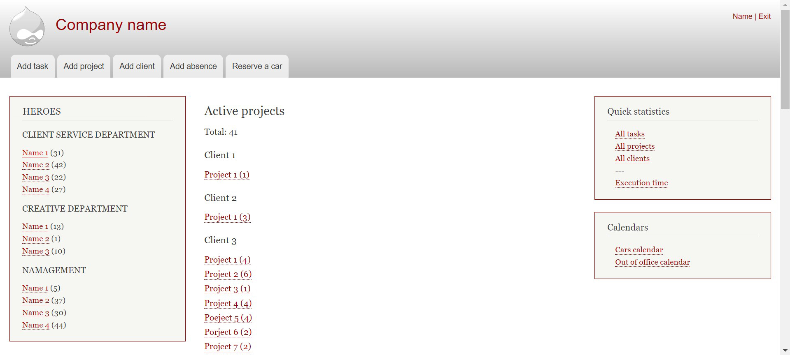

## PM APP
This application is a simple project management solution for the company I am currently working in.

## Table of contents
* [General info](#general-info)
* [Technologies](#technologies)
* [Setup](#setup)
* [Features](#features)
* [Status](#status)

## General info
The application is inspired by a cryptic project management system, created with Drupal. The company I am working in 
has been using it for tracking the progress of the team's weekly tasks, projects and clients for several years. 
Here is an example of its homepage:



The system was written once and rarely maintained, it's technology got old and there are architectural, logical and 
UX details, which need a significant optimization. That is why I decided to rebuild the system from ground up and completely 
overhaul the way it looks and functions.

## Technologies
The project is created with:
* React
* CSS 
  * Vanilla CSS created for the project's purposes following the company's 
    visual guidelines. The company website can be found [here](https://publicis-dialog.bg/).
* NodeJS
* MongoDB Atlas

## Setup
To run this project, install it locally using npm:

```
cd ../client
npm install
npm start
cd ../server
npm install
npm start
```

## Features
The application allows you to:
* Register (only registration form and information submission is implemented until now)
* Create client
* Create project
* Create task
* See overall status of active tasks
* See overall status of active tasks per user and complete, edit or delete task

## Status (04.04.2021)
The project is currently under development with many important features to be implemented:
* Authentication
* Form submission messages
* Code refactoring and improvements
* Transforming the class components into functional components (after project defence)
* Miscellaneous UX tweaks

